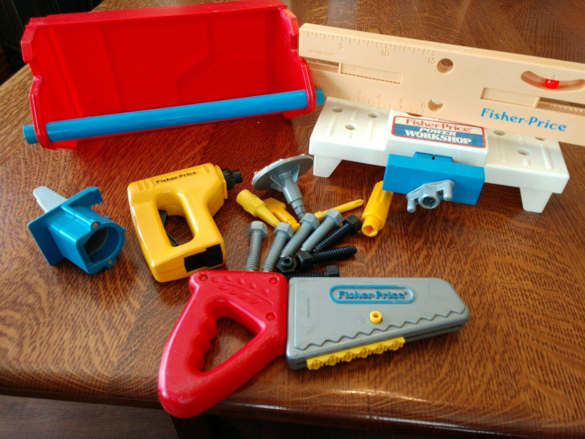
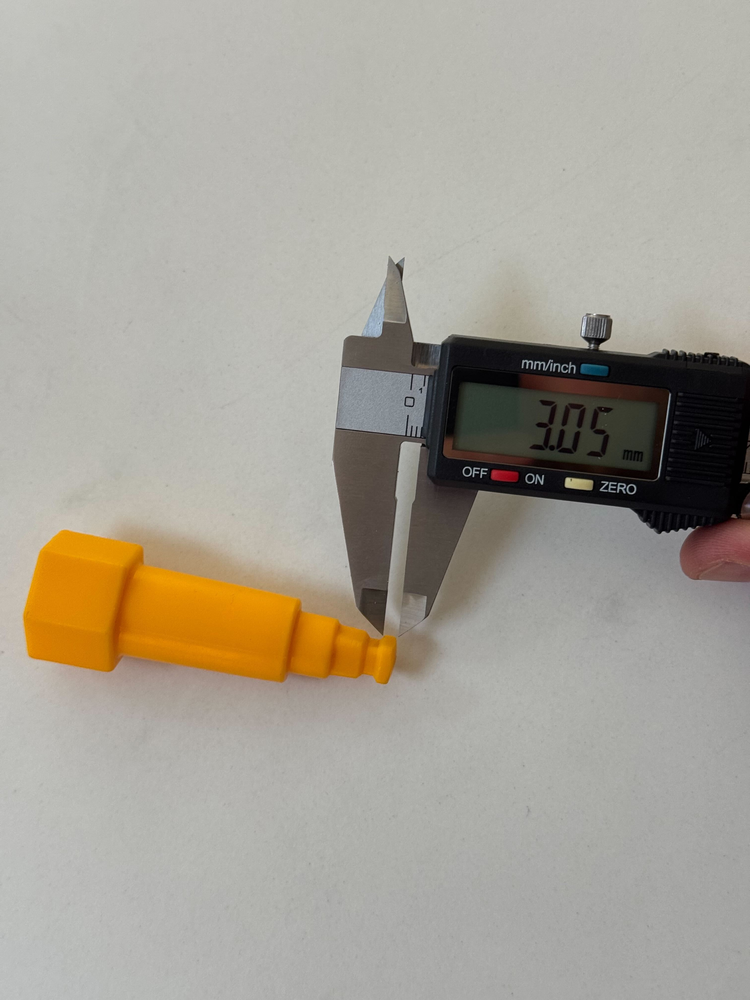
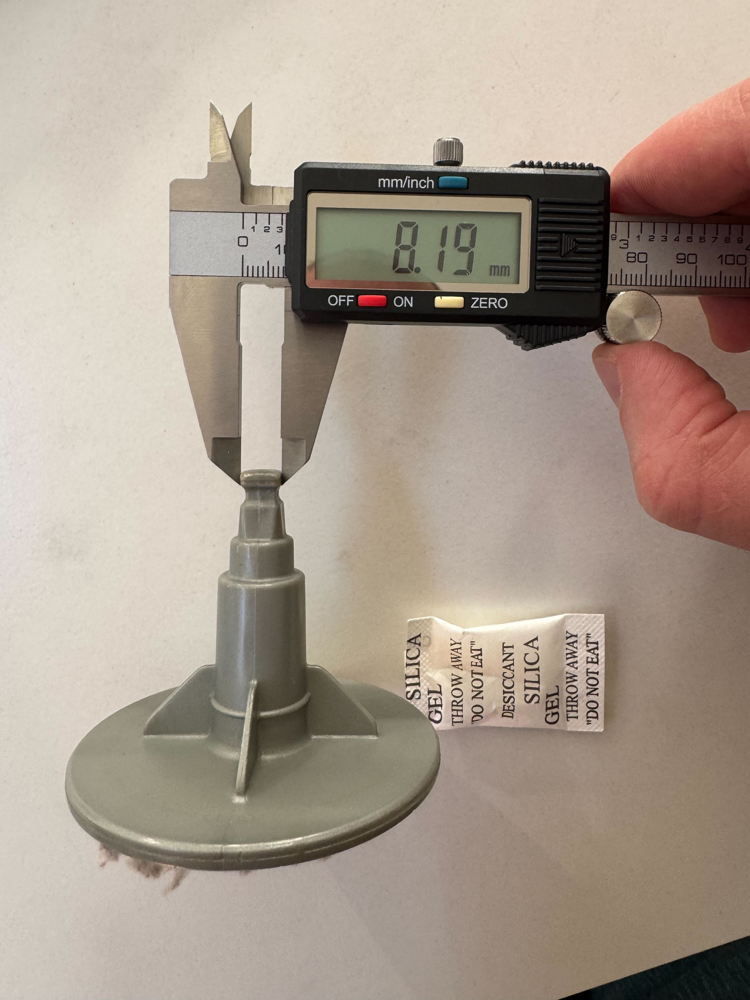
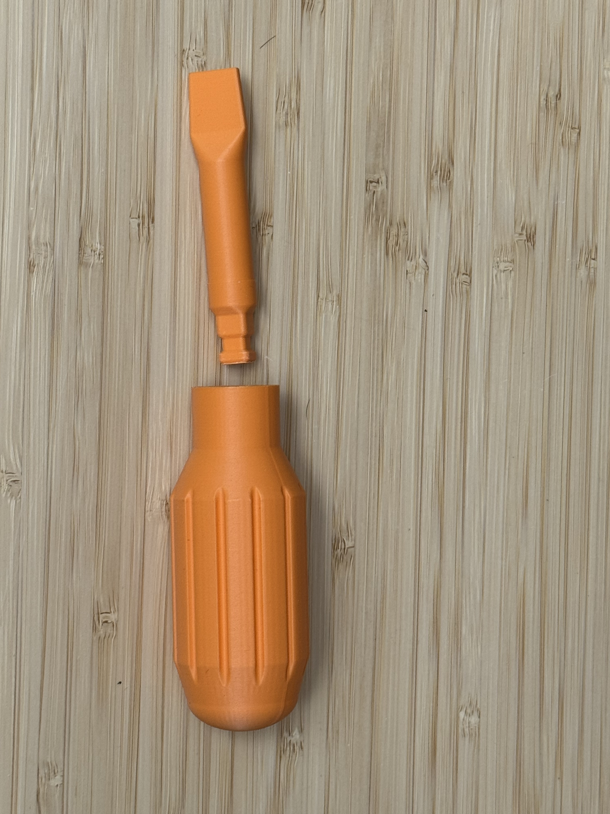
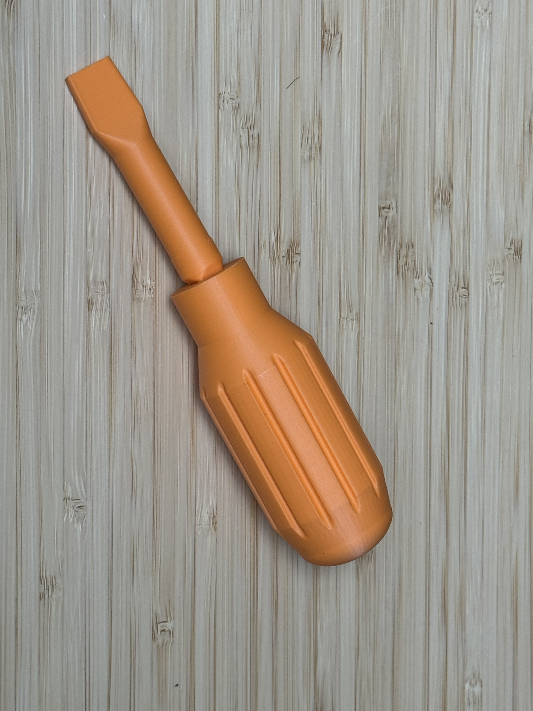
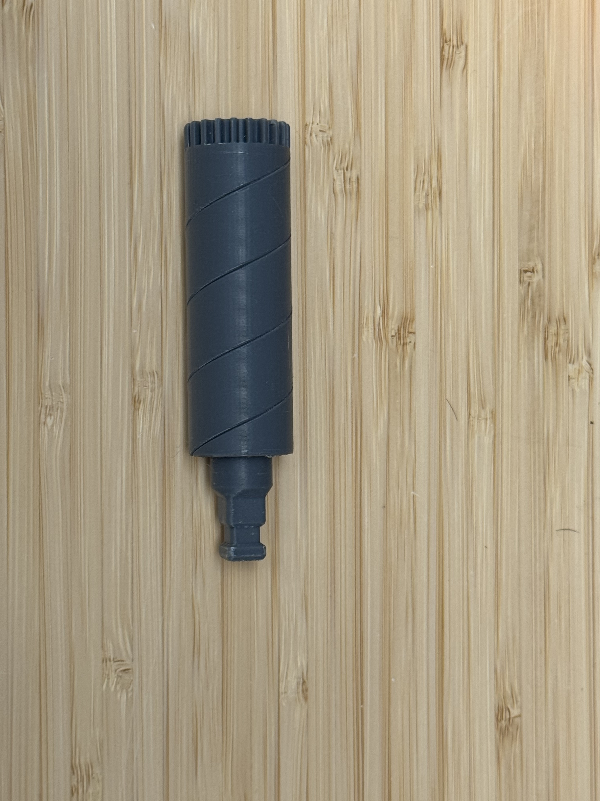
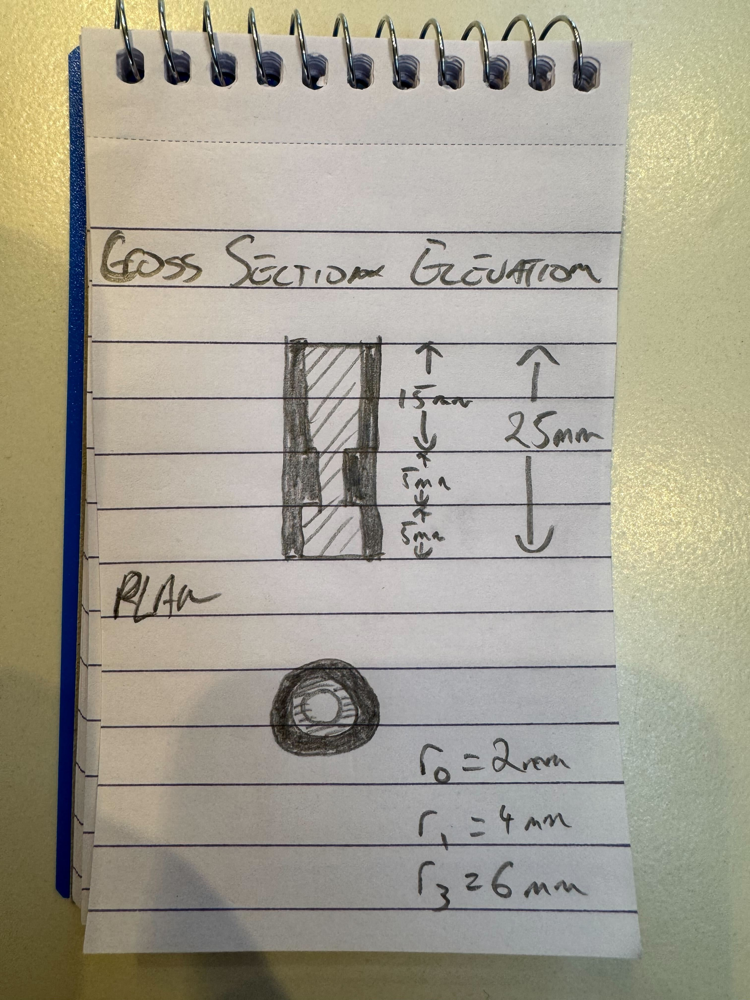

# 3D modelling with OpenSCAD

When I was growing up I had a toy workbench with a drill, saw, vice, screwdriver and a handful of bolts. Years later the set was still mostly intact but some of the attachments had gone missing or the connections had come loose, so I decided to try 3D printing some replacement parts.

I had already used OpenSCAD to design a [small plastic foot](https://www.bstjohn.net/3d-models/#sink-tray/tray-foot) for a tray to replace one that had broken, so I decided to invest some time and effort in a pipeline to help designing models in OpenSCAD. OpenSCAD, for those who don't know, is a programming language rather than a click-and-drag CAD tool — dimensions are variables and shapes are functions, so there's no mouse-driven interface or no feature tree. Objects are described in code to build parametric models, which makes it ideal for use with coding agents like Claude or Codex, etc.

## The broken connection bits

All of the drill bits, screwdriver heads, etc, use the same male connection to plug into the toy drill through the same square peg. So the real work wasn't the individual attachments at all — it was getting that one shared connection right. Once that was solid, each attachment was just its own shape sitting on top of the same interface. I keep the connection in its own library file (`_connection.scad`) and the attachments all include it and build upward from there.

Getting the fit right required a few iterations. Measure the original peg, print a test piece, test the print, adjust the tolerances, print again. The measurements live in the source as named variables — the shaft is `shaft_sq = 8.2` mm across, for instance — so each round of tweaking was just changing a number and re-rendering. To cut down on waste during the iteration I created minimal [male](https://www.bstjohn.net/3d-models/#power-workshop/test-male) and [female](https://www.bstjohn.net/3d-models/#power-workshop/test-female) connectors.

The original toy is injection-moulded and the plastic flexes a little, so a snap ridge running all the way round the [socket](https://www.bstjohn.net/3d-models/#power-workshop/drill-socket) grips nicely without being a problem. Rigid printed plastic doesn't flex like that. My first attempt with a full ridge was so tight the shaft wouldn't go in, and when I forced it I was clearly going to crack something. The fix was to stop running the ridge all the way round and instead concentrate it at the four corners only, so there's enough material to grab and hold but the shaft can still push past with a firm shove.

The most recent additions were the [screwdriver handle](https://www.bstjohn.net/3d-models/#power-workshop/screwdriver-handle) and its bit, which reuse the same connection from the other end — the handle is the female socket, so a bit can plug straight into it. I don't think a screwdriver handle was ever included in the initial set. Since I had the male & female connections specified though, printing a handle was very simple.

The original [drill bit](https://www.bstjohn.net/3d-models/#power-workshop/drill-bit) had been completely lost, but measurements of the holes that it "drills" and marketing images of the original piece were enough to let Claude recreate the piece for me.   

## Other parts it's been good for

It's not all toys. The example I reach for when someone asks what this is actually useful for is a [sink tray foot](https://www.bstjohn.net/3d-models/#sink-tray/tray-foot), because it's the most boring possible version of the workflow and it still worked. One of the little feet on a sink tray had snapped off, and rather than buy a whole new tray I figured I'd just print a replacement.

I measured the old foot and sketched the cross-section on a notepad — a stepped cylinder, basically, with radii of 2, 4 and 6 mm and about 25 mm tall. Then I handed the sketch and the numbers over and asked for OpenSCAD. What came back was about 35 lines, and every variable in it mapped to something I'd actually measured, which made it easy to check. The first print didn't quite fit — the counterbore for the screw was a touch tight — so I nudged the tolerance and printed it again, and the second one was spot on.

## Supporting Infrastructure

I ended up building quite a few features around the actual modelling to improve the workflow. I wanted to be able to push a `.scad` file and have everything else just happen, so I put together a GitHub Actions pipeline that does exactly that.

When a new or updated `.scad` file is pushed, the pipeline renders the STL, makes a PNG thumbnail with headless OpenSCAD and xvfb, runs the mesh through ADMesh to check it's sound, composites a hero image out of the thumbnails, and rebuilds the single-page site with its interactive Three.js viewers. When I open a pull request, it deploys a preview to its own URL and leaves a comment with thumbnails of whatever models changed, their file sizes and triangle counts, and a table showing whether each one passed mesh validation.

I've got coding agents wired into it through my [Claws setup](https://github.com/stjohnb/claws-snapshot). It picks up issues I've written and works them, drafting plans & implementing designs. It does a good job of taking half-formed ideas and turning them into something reviewable without me sitting down to do it. There's a longer write-up of how Claws works [over on the blog](https://www.bstjohn.net/blog/claws/) if you're curious.

## The web viewer

The viewer is a single `index.html` with no build step — no React, no bundler, no npm. It's plain ES modules pulling Three.js in from a CDN through an import map. Each model gets its own little canvas with orbit controls, a row of filament-colour swatches so you can see roughly what it'll look like printed, and the viewers load lazily as you scroll so the page isn't trying to spin up a dozen WebGL contexts at once. For something I mostly look at to check a model came out right, keeping it to one file has been very little hassle to maintain. It's all live at [bstjohn.net/3d-models](https://www.bstjohn.net/3d-models/) if you want to spin any of these around yourself.

There's also an in-browser customiser now, which I'd previously had on my "maybe someday" list. A model can ship a small manifest exposing some of its dimensions as sliders, and clicking **Customize** loads a WebAssembly build of OpenSCAD, re-renders the part right there in the tab with your changes, and lets you download the result. It's slower than running OpenSCAD natively and it pulls down a few megabytes the first time, but it means you can tweak a part without installing anything.
