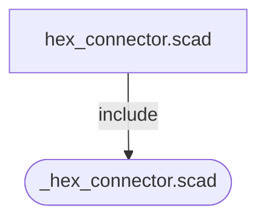

# Dependency Graph

> Auto-generated by `scripts/scad-dep-graph.sh` — do not edit manually.
>
> Regenerate: `bash scripts/scad-dep-graph.sh`

Library files use rounded nodes; renderable files use square nodes.
Edges are labeled `include` or `use`.

